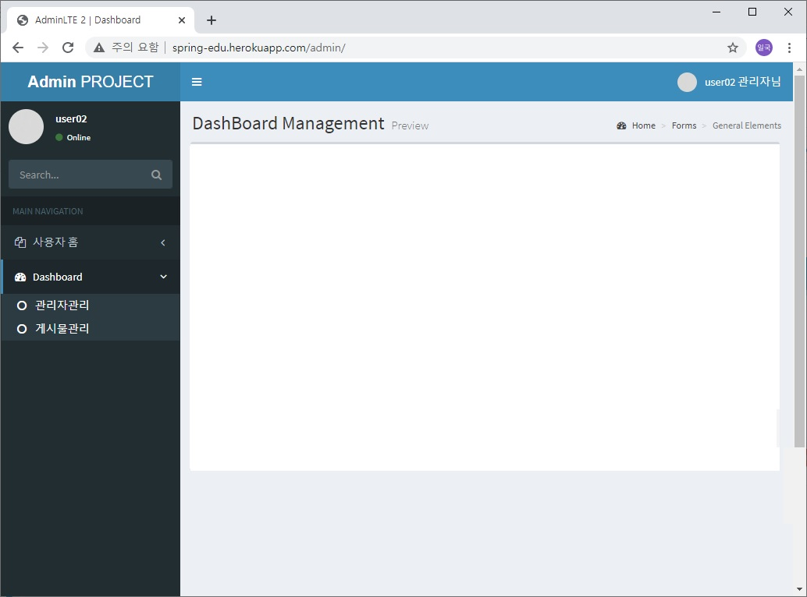

#### 20201202(수) 작업
- admin폴더에는 크게 2가지기능: 관리자관리(member폴더에), 게시물관리(board폴더에)
- 상대경로: ./(현재폴더위치), ../(상위폴더위치), 파일위치를 지정할때 사용.return(스프링 반환값)
- 절대경로: URL경로(웹브라우저로 접근가능한경로)를 사용할때. @RequestMapping에서(스프링)
- 게시판 html화면 구현하기 전, 관리자관리 부분 제어용 컨트롤러 클래스 만들고 있습니다.
- admin/include/header.jsp의 메뉴링크를 html상대경로에서 Admin컨트롤러의 절대경로로 변경처리.(아래)
- /admin/member_list(관리자관리 메뉴와바인딩), /admin/board_list(게시물관리 메뉴와 바인딩)
- 데이터를 전송/수신하는 관계는 나중에 진행됩니다. 오늘은 URL과 jsp만 바인딩만 시킵니다. 
- 저장소이름: 변수(내용에 변하는 값을 java로 불러옴)  / 상수(내용에 정해진 값을 불러옴)
- member_view.html 마무리.
- member_write.html 화면작업: 부트스트랩참조URL(아래)
- http://localhost:8080/resources/pages/forms/general.html
- 이것이 자바다 4번째 과목 교재수령 방법 한번 더 공지(수,목 오후 6시~8시까지 학원방문수령)
- 12월3일(목) 화면구현 시험(포트폴리오제출) 공지
- ------------------------------------------------------------- 
- 화면설계시험 과제물제출 미응시 하신분만 확인해주세요(아래),
- 오늘 5시40분 이후 줌에서 오늘날짜 시험지 받으셔서,그림판에서 이름 작성 후 
- 평가지그림판 및 과제물을 강사 이메일(boramcom@daum.net)로 제출해주시기 바랍니다.(제출 시간은 오후 5시 40분 이후 입니다.)

#### 20201201(화) 작업
- html lang="en" 이부분은 여러분PC가 영문 윈도면 정상.
- 그런데, 우리PC는 한글윈도우 이기 때문에, html lang="ko"로 변경하시면 편리합니다.
- 외부라이브러리 불러오는 상대경로를 절대경로로 변경.
- AdminLTE로 만드는 스프링 관리자 메인 html화면구현 마무리.
- 관리자관리: member_list.html, member_view.html, member_write.html
- 게시물관리: board_list.html, board_view.html, board_write.html
- 관리자단 html화면구현한 내용을 jsp 만들어서 컨트롤러자바클래스에서 링크만 걸어 줍니다.

#### 20201130(월) 작업
- AdminLTE로 만드는 스프링 관리자 메인화면 구현 샘플(아래)

- AdminLTE다운받은 압축파일을 풀어서, 폴더(dist,pages,plugins), index(1,2).html
- 위 6개를 resoureces폴더에 붙여 넣습니다.
- 프로트엔드단 대세중 2가지 플러그인(자바스크립트템플릿) 위에 포함되어 있습니다.
- 첫째, 부트스트랩.
- 둘째, chartJS(빅데이터 시각화할때 사용 JS템플릿)
- 위 기술만 가지고는 수입이 부족하기 때문에, 스프링을 배웁니다.
- plugins중 ;문장끝 바로 앞에 , 존재하면 에러표시가 나옵니다.
- 고전자바스크립트(네이티브 자바스크립트)에서는 위 문제가 에러표가 되지만, 아래 es6부터는 정상으로 표시가 됨. es6,es5(엑마스크립트 버전을 말합니다.)
- 자바스크립트 버전, es5(2015년 js버전)이전버전-위 문제 에러, es6(2016년 js버전)-위 문제 정상.
- dist: distribute(배포)하는 폴더명, 이 폴더만 있으면 실행이 가능합니다.
- 그래픽이미지 2가지: 비트맵 이미지(jpg, gif, png 이런이미지는 화면을 확대하면 깨짐, 이미지1개면 끝), 벡터 이미지(화면을 확대해도 깨지지 않음, 스크립트코드로 만들어진 이미지).

```
<svg xmlns="http://www.w3.org/2000/svg" xmlns:xlink="http://www.w3.org/1999/xlink" width="210" height="210">
  <rect x="5" y="5" width="200" height="200" style="fill:red; stroke:black; stroke-width:10px"></rect>
</svg>
```
- SVG이미지는 개발자 입장에선, 안드로이드 스튜디오에서 버튼또는 이미지만들때 사용. xml로 만듭니다.
- AdminLTE를 사용하면, 좋은 이유(아래)
- font어썸제공. 사용예, <i class="fa fa-cc-visa" style="color:red;"></i>
- IFrame(아이프레임): 이 태그를 사용하면, 예전 프로그래머라고 생각하시면, 않됩니다.
- 구글맵(지도),유투브 퍼가기에서 사용하고 있습니다.
- 아이프레임은 화면레이아웃과는 상관없이, 콘텐츠가 들어갈 영역을 잡는 역할을 하는 태그 입니다.
- URL 외부 콘텐츠를 가져다가 우리 홈페이지에 끼워넣을때 사용합니다.
- SCSS는 CSS 파일을 컴파일한 파일을 SCSS라고 합니다.
- .jsp 또는 .java를 컴파일하면 .class실행파일이 만들어지는 것과 같은 원리. 
- 스프링에서는 관리자단, 사용자단이 나눠져서 개발됩니다.(보안때문에생긴 트렌드 입니다.)
- 관리자단은 거의 외부 디자인템플릿을 사용합니다.(예, AdminLTE)
- 사용자단은 거의 개성있는 내부 디자인을 사용합니다.(예, 퍼블리셔가 부트스트랩기반으로 작업합니다. 현재 트렌드 입니다.)
- AdminLTE(부트스트랩기반 디자인템플릿)로 관리자단 화면을 구현.
- 위 템플릿을 사용한다는 것은, 템플릿의 html-css-js를 갖다가 사용하는 방법을 익히시는 겁니다.
- 위에서 화면구현 한 스태틱 html소스를(퍼블리셔가 만든소스), V6.0.0시간에 jsp로 변경하셔서, 프로그램을 입히시게 됩니다.(개발자 하는일) 
- 헤로쿠 Deploy메뉴에서 작업을 했는데, 적용이 않되시고, 예전내용이 보이시는 경우,
- 헤로쿠에서 Deploy하실때, 깃허브에서 자료를 가져오게 되는데요, 약간 시간차가 있을 수 있습니다.
- 또는, 커밋/푸시가 잘 되었는지 확인해 주신 후,다시 Deploy해주시기 바랍니다.
- 구글 문서 작성방법(아래)

```
jsp파일과, css소스 복사해서 붙여 넣으시고, 이미지 캡쳐는 지금 화면에 보이는데로 크롬 개발자도구에서 Toggle Device Toolbar를 클릭한 후 Responsice에서 
731(모바일), 1131(태블릿), 1132(PC) 각각 1개이상씩 캡쳐해서 구글 문서에 붙여 넣으시면 좋겠습니다.

```
- 나눔고딕폰트 불러오기 할때, mobile.css만 해주셔도, 다른 기기에서 모두 적용 됩니다.
- 위 이유는, html, css, js는 소스라인 위쪽에서 아래로 적용이 됩니다.
- 그래서, 모바일.css 제일 상단에 있기 때문에, mobile.css에서 적용하면, 아래쪽(tablet, pc)에 모두 적용 됩니다. 
- 참고, 이클립스에서 소스 검색후 한꺼번에 바꾸는 기능위치는 Edit메뉴->Find/Replace 클릭.
- 지난주 태블릿이상메뉴에서 메인과 서브페이지 상단 메뉴 크기변동 문제 처리예정.(아래)

```
<!-- mobile.css -->
body {
line-height:1.4 !important;/*!important 추가*/
font-family:'Malgun Gothic', dotum, sans-serif !important; /*글꼴고정추가*/
}
```
- 12월3일(목)2교시 과제물 서식 배포 예정.(과제물 서식 설명하면서 지난주 jsp 작업 리뷰 및 헤로쿠 클라우드 URL확인) https://drive.google.com/file/d/1Y9Mrukyr-6tmn9RFfkQzbTMR2l0B8jsJ/view?usp=sharing
- 지금까지 한것 깃에 푸시 하고, 헤로쿠 클라우드에서 Deploy(배포)합니다.
- 화면구현 과제물 작성시간 드립니다.(2교시+3교시)
- 4교시 부터 AdminLTE 부트스트랩 기반의 디자인 템프릿을 사용해서 관리자 화면구현 실습 진행 합니다.

#### 20201127(금) 작업
- 스프링부트 버전2.0 (조그만동생): 소규모 프로젝트(스타트업)-조달청에 올라가는 프로젝트X
- 스프링부트 자동으로 생성되는 코드많아서, 사용하기 편하지만(장점), 커스터마이징 한계가 있습니다.(단점)
- 스프링프레임워크 버전4.3.22 (큰형): 중대형 프로젝트 - 조달청에 올라가는 프로젝트O
- 스프링프레임워크는 커스터마이징하는 프로젝트에 유용합니다.(장점), 복잡하다는 것이 단점.
- /resources/sample/반응형페이지 : 실제서비스되는 내용은 아닙니다. 퍼블리셔가 만들어서 준것을 개발자가 여기다 배치 하는 공간 입니다.
- 위와 같은 콘텐츠를 Static콘텐츠라고 합니다.(스태틱은 고정적인 내용-html, css, js, img)
- Static콘텐츠(많이사용)반대<->동적콘텐츠(jsp 프로그램으로 콘텐츠 내용이 수시로 변경되는 영역)
- 대표적인 Dynamic콘텐츠영역 : 게시판 입니다.(게시물을 등록하면, 콘텐츠가 동적 늘어납니다.)
- 실제 개발은 위에서 만든 퍼블리셔 결과물을 이용해서 WEB-INF/views 폴더에 개발한 결과를 배치하게 됩니다.
- 헤로쿠 클라우드에서 서비스 되는 페이지가 WEB-INF/views 폴더에 위치하게 됩니다.
- WEB-INF/views/sample폴더 생성 후 index.jsp
- 컨트롤러 자바클래스에서 외부에서 /접근시 index.jsp로 매핑시킨 후 확인.
- 퍼블리셔가 만든 index.html 복사해서 index.jsp 붙여넣기 후 확인.
- jsp분리작업: include폴더 생성후 그안에 header.jsp, footer.jsp 2개만듭니다.
- index.jsp 에서 header.jsp에 들어갈 영역 Cut해서 붙여넣기.
- index.jsp 에서 footer.jsp에 들어갈 영역 Cut해서 붙여넣기. 후 확인.
- -------------------------------------------------------------
- 반응형 웹페이지 작업 결과를 스프링MVC프로젝트에서 home.jsp로 변환.
- http://localhost:8080/ 새로만든 home.jsp가 나오도록 하겠습니다.
- 위 home.jsp 결과물 헤로쿠 클라우드에 올릴 예정.
- 최종결과: https://kimilguk.herokuapp.com (반응형 홈페이지 나오게 됩니다.)
- 파스타 클라우드 초기화 따른 파스타 재신청 처리예정.

#### 20201126(목) 작업
- 반응형 웹페이지 작업 마무리. 

#### 20201125(수) 작업
- 테이블 태그:(아래) 

```
<table>
<tr>
	<th>영화제목</th>
</tr>
<tr>
	<td>죠스</td>
</tr>
<tr>
	<td>인디애나존스</td>
</tr>
</table>
```
- tr: table row  : 테이블의 가로 선 영역.
- th: table head : 테이블의 가로선내에 제일 상단에 있는 컬럼(필드) 영역.
- td: table data : 테이블의 가로선내의 컬럼(필드)데이터 영역.
- 유스케이스다이어그램(이클립스): 관계(릴레이션-Relation)
- 관계: Generalization(일반화) - 부모-자식(상속관계)
- 관계 일반화란? 자식들(SUV,소형차,중형차,대형차)-extend -> 부모(자동차-일반화)-generalize
- 관계 include? 포함관계,footer.jsp(하단Logo) --> home.jsp <-- header.jsp(상단메뉴,로고포함)
- 관계 extend? 확장관계(상속관계)
- ---------------------------------------------------------------------------------
- NCS학습모듈(화면구현) 단원1 OK.
- HTML(Hyper-Text-Markup-Language)+CSS(Cascade-Style-Sheet)+JS(JavaScript)
- 위 3가지 작업으로 결과물을 만드는 사람을 퍼블리셔 라고 함.=프론트엔드 개발자.
- 웹접근성(WebAccessbility): 사이트의 장애인 이용 가능성을 체크.(프로젝트 제안요청서에 항상 포함됨)
- 크로스브라우징(Cross Browsing): 다양한 웹브라우저에서 콘텐츠가 깨지는지 확인.(제안요청서에 항상 포함됨)
- UI(User Interface)테스트: 사용성 테스트.
- CLI(Command Line Interface): 예, cf cli 프로그램설치(파스타)
- GUI(Graphic User Interface): 예, 이클립스에서 파스타 서버사용.
- HTML5표준으로 만들어야 한다: 제약조건입니다.
- 11/12번째 과목에서 화면설계서작성ppt(강사제공),아카텍쳐구조도엑셀파일(학생),사용자매뉴얼ppt(학생) 내용채워서 제출 ( 이력서 제출시-사람인취업사이트에 학생이 제출 : 포트폴리오로 위 2가지 문서 제출하게 됩니다.) 
- 6번째 과목마치면(내년2월초) 이 프로젝트를 가지고, 위 문서 3가지 있어야지, 완료보고가 가능합니다.
- 위 사람인에 이력서 제출시 프로젝트 클라우드 URL(헤로쿠, 파스타)도 제출.(취업처회사에서 확인)
#### 20201124(화) 작업
- RFP만들기전에 ISP(정보화전략계획:새로만들시스템의 타당성조사):1억프로젝트면 1000만 문서화 ->
- IT발주업체(RFP:제안요청서을업로드:발주입찰공고) -> IT개발사들(제안서를제출:입찰-소속된개발자작업시작)
- 실행파일 확장자. .jar(자바archive실행파일),.war(웹archive실행),
- .apk(안드로이드Package실행),.aab(안드로이드AppBundle실행)
- 스프링웹프로그램, 안드로이드앱 제작 후 테스트가 2가지 후 운영배포(구글프레이스토어기준아래)
- alpha(알파)내부테스트, beta(베타)외부테스트, 프로덕션(상품)배포.
- 모바일용  화면처리 작업 마무리. OK.
- index.html 파일에서 슬라이드부분 적용(부트스트랩-외부j쿼리라이브러리이용) OK.
- 단원2-2 상세설계부분 이론 예정. OK.
- 반응형에 사용에 대해서 이론설명.(미디어쿼리에대한 설명)
- 반응형의 목적은 1개 소스로, 스마트폰, 태블릿, PC화면에서 콘텐츠내용이 잘 보이게 처리하는것.
- 소스를 스마트폰용과 PC용으로 나눠서 하면, 장점: 소스가 단순해져 만들기편함. 단점: 유지보수가 어렵다는것.
- 반응형의 장점은 유지보수가 쉬워짐.(소스1부분만 수정하면되니까), 단점은 초기에 신규생성이 어렵다는것.
- 테블릿용,PC용 화면처리 작업 시작.
- 카카오상담 참여 공지.(본인이 일하고 싶은 분야 카톡으로 알려 주세요)
- 수요일 시험 공지.

#### 20201123(월) 작업
- CSS값 3개일때: 18px(상여백) 5%(좌우여백) 18px(하여백)
- 공공클라우드(public cloud): 아마존, 구글클라우드, 헤로쿠- 정보를 클라우드 사업사( 정보유출우려높음:관공서X,대학X, 대기업X(간단한 팀별로 프로토타입만 사용)-스타트업에선 많이사용함.
- 사설클라우드(private cloud): 파스타 - 고객회사 구축해서 사용.(정보유출낮아서 관공서O,대학O), 조달청(나라장터)에 올라오는 일거리는 대부분 사설 클라우드 기반입니다.
- select box(웹앱) = combo box(PC앱)
- Mysql(마리아DB)-회원이 1만명이상이면 시스템이 버벅거리는데, 해결책을 달라고 합니다.
- 답변: 오라클로(MS-SQL)로 마이그레이션 해야 합니다.
- 기능적요구사항: 개발자가 담당.
- 비기능적요구사항: 동시 접속자 수를 100명 1000명으로 늘려달라는 요구사항(하드웨어 기능 올려야 해결)
- 위 내용은 순간 트랙픽용량을 10M -> 100M로 상향해달라는 요구사항.-개발자인건비로 해결X 
- 내용상 카카오오븐 프로토타입(학생) -> 화면설계(강사).참조 -> html,java(학생) 코딩에 진입.
- 카카오오븐으로 프로토타입을 만드셨고, 과제물로 제출하실 예정.
- 화면설계서는 강사가 제시한 것을 참조해서, 화면구현(html로 반응형)에 사용하시게 됩니다.
- contact.html : form태그(자료전송하는 역할로 프로그램과 연동하는 부분이라서 중요함)
- blog.html 만들고 확인.
- 화면전환효과: transition 속성을 사용.
- CSS에서 가상선택자란: 1. 가상클래스, 2. 가상요소, 1+2= 가상선택자라고 합니다.
- 1. 가상클래스: *표시 a:hover(a링크인데, 마우스가 a링크영역 위에 떠 있을 때의 영역)
- 2. 가상요소:: *표시 a:hover::before(a링크에 마우스가 위에 떠 있을 때의 a영역의 앞의 영역)
- work.html 파일 마우스 롤오버 이벤트 모바일용 CSS적용.
- 페이지 모바일용 CSS작업이 마무리되면, reset.css처럼 외부로 css파일을 분리하는 작업이 있습니다.
- 나머지 페이지들도 작업예정.
- NCS학습모듈 이론 단원2 부분 학습예정.
- 모바일용 작업 후 태블릿용과 PC용도 이어서 작업예정.(마무리 못하면 V3.0.0화면구현(jsp)과목에서 이어서 작업합니다.)
- [공지]파스타클라우드 11월26일(목) 뒤집어 엎어질 예정.(재신청필요)

#### 20201120(금) 작업
- 소스 이쁘게 만들기 이클립스 단축키: source메뉴 > format 클릭하면 됩니다.
- alter용어: 키보드의 Alt키 교체하다는 의미. Alter table 명령DB(더미데이터)
- img태그의 Alt속성: 이미지가 나오지 않을때, 대체(대신)로 나오는 문자입니다.
- 1일기준: 1,2가지 확실하게 아시것이 있으면됩니다. 쌓여서 실력이 됩니다.
- 로렘 입숨(lorem ipsum; 줄여서 립숨, lipsum) 
- 한글 입숨: http://hangul.thefron.me/
- 영문 입숨: https://www.blindtextgenerator.com/lorem-ipsum
- 페이지 제작 순서(아래)
- 1. 이클립스에서 파일생성하고, html 립숨데이터 만들기.
- 2. 영역분리하기: 클래스 이름 지정하기.
- 3. CSS 적용하기: 자바스크립트 작업포함.
- 4. CSS 분리하기: 테스트 후 마무리.
- 페이지 강력새로고침 단축키: [Ctrl]+[Shift]+[R]
- 프로그램에서 대소문자, -, _ 에 대해서 설명드리겠습니다.(아래)
- 우선 DB에서는 테이블명, 필드명 모두 소문자로 표시로 통일 합니다.(선택적 필수)
- 자바스크립트, 스프링(자바)에서는 변수/함수명, 클래스명 2가지로 나눕니다.(아래)
- 우선 클래스명은 대문자로 시작합니다.(필수)
- 변수/함수명은 소문자로 시작합니다.(선택적 필수)
- 특히 CSS에서는 클래스명에 -(하이픈)이 가능합니다. 단, j쿼리(자바스크립트)에서는 변수/함수명에 - 이 들어가면 않됩니다.

- CDN(Contents Delivery Network): 콘텐츠를 네트워크로 전달받아서 사용하는 방식.
- 어제 수업시 작동않되던 네이티브 자바스크립트 사용예시
- 어제 작동이 않되었던 이유: 위에서 아래로 순서를 가지고 실행이 됩니다.
- document.getElementsByClassName는 배열값을 리턴
- document.getElementById는 1개값를 리턴

```
window.onload = prepareButton;
function prepareButton() {
	var toggle_btn = document.getElementsByClassName("menu-toggle-btn");
	toggle_btn[0].onclick = function(){
		alert("햄버거메뉴를 클릭했습니다.");
	}
}
```
- CDN jQuery코어 받기 다시한번 강의.
- $(".gnb").stop().slideToggle("fast"); j쿼리 토글메뉴 예시
- 작업순서1: 이클립스에서 html만들고, 더미데이터 html 생성.
- 작업순서2: body에서 레이아웃을 3가지 영역분리 header, section, footer. 
- *작업순서3: header영역의 3가지영역(로고, 햄버거메뉴, 글로벌네비메뉴)를 배치작업.
- 작업순서4: 로고의 세부영역 디자인.
- 작업순서5: 햄버거메뉴 영역의 세부디자인.
- 작업순서6: 글로벌네비메뉴 영역의 세부디자인.
- 작업순서7: 자바스크립트로 햄버거메뉴의 토글기능 구현.
- 작업순서8: 본문section영역 세부디자인(슬라이드부분 J쿼리로 구현-PC용 CSS까지 작업 후 적용).
- 작업순서9: footer 영역 세부 디자인.- 사용자css(모바일용헤더,푸터), 사용자js(햄버거메뉴작동)
- 작업순서10: 마무리. home(index.html)메뉴의 작업 테스트 확인.
- 1페이지 모바일용 CSS작업이 마무리되면, reset.css처럼 외부로 css파일을 분리하는 작업이 있습니다.
- 나머지 페이지들도 작업예정.
- =================================================
- 모든페이지 모바일용 작업 후, 태블릿용, PC용 디자인 추가 합니다.

#### 20201119(목) 작업
- 자바스크립트: 종류 2가지입니다.(아래)
- 네이티브자바스크립트(고전): 오늘 배우고...
- jQuery(현재트렌드): 앞으로 계속 하고...
- jQuery: 자바스크립트 프레임워크를 말합니다. j쿼리 코어라고 합니다.
- j쿼리 사용법: 코어파일이 필요.(인터넷으로 가져와서 사용가능-CDN방식 합니다.)
- 콜백함수란? 고전 함수처럼 함수명이 있는 것이 아니고, function()처럼 자동실행되는 함수.
- 함수형식(아래): 
- function Add(a,b) {
- var sum = a+b;
- alert(a + "더하기" + b + " 는 " + sum + "입니다.");	
- }
- 함수실행: Add(3,5);//함수명(매개변수1, 매개변수2);

- 함수란? 입력값이 있고, 출력값이 있는 것을 함수.(사칙연산 +,-,x..)
- 대표적인 에러메세지:(HTTP Status 웹브라우저 상태 에러 아래)
- 404 Not Found: 경로에 파일이 없을때.
- 500 Error : 스프링(자바)프로그램에러일때.
- 인덱스:index 색인(책끝에 가,나,다...), 특징 0부터 시작하는 순서를 가지게 됩니다.
- var member = [
			{name : "김일국"},
			{name : "이병현"},
			{name : "남가인"}
		];
		
```
- 출력: member[0][name] => "김일국";
```

- 소괄호(), 중괄호{}, 대괄호[]

```
*, :after, :before { /* :콜론의 의미 가상요소(선택자)
    -webkit-box-sizing: border-box;/* 크롬,사파리용 크로스브라우징때문에 추가 */
    -moz-box-sizing: border-box;/* 파이어폭스용 크로스브라우징때문에 추가 */
    box-sizing: border-box;/* IE용 박스크기를 지정하는데 테두리포함하겠다는 의미 */
}
```
- index.html 더미데이터에 모바일용 CSS적용예정.
- html(jsp)영역지정방식: tag방식, class방식, id방식
- id방식은 현재html문서에서 1개만 존재해야함.(로그인시 사용하는 아이디와 같은 기능)
- class방식은 현재html문서에서 여러개 존재해도 가능함.
- reset.css 를 불러옵니다.(작업전 사전준비) 이 역할은 아래
- 크로스브라우징 사전처리 역할(아래)
- IE, 크롬, 파이어폭스, 사파리(Sapari) 다영한 웹브라우저 콘텐츠가 같은크기로 보이게 하는 역할
- --------------------------------------
- 메뉴 클릭에 대한 자바스크립트적용.
- index.html 에 태블릿용 CSS적용예정.
- index.html 에 PC용 CSS적용예정.

#### 20201118(수)
- 반응형 페이지를 위한 더미데이터 입력(index.html) 
- html5(버전): Hyper Text Markup Language (링크기능)
- html5 버전은 이전 버전과 무슨차이가 있는지 확인.
- Tag태그로 구조화된 문서 Document 입니다.
- 태그사용 기본형식: <태그명> 내용 </태그>
- 진입점이 무엇인지 실습: 자동실행되는 부분.
- 홈페이지실행: index.html만들었는데 의미: 홈페이지 진입점을 말하고, 자동 실행됩니다.
- 자바프로그램실행: main() 메서드를 만들고 자동실행되는 진입점 입니다.
- 주)윈도에서는 대소구분없음. 리눅스기반, 스프링(자바)기반에서는 대소문자 구분이 있습니다.
- 클래스명은 대문자, 파일명 소문자, DB테이블명 소문자.

- webapp폴더 내에 resources/sample 폴더만듭니다: 디자인에서 사용하는 리소스
- src/main/resources 폴더 위 폴더와 틀립니다. 이 폴더는 자바프로그램 리소스 입니다.
- 5개월 짜리 프로젝트: 초기 1개월 ERD만들어야 하는데, 않하고 프로그램 들어가면, 100%실패.
- 회사에서 프로젝트 하시면, 성공하는 경우 10건 1건밖에 않됩니다.
- 1번 프로젝트하고(4000만이상), 1년 무상보수 하고, 이후에 계속 관계가 유지되는 회사.
- 포토피아-온라인 포토샵 입니다.(무료) https://www.photopea.com/
- Form(폼). 자료를 전송할때 사용하는 html 태그 입니다.
- 폼요소=폼컨트롤=폼태그=폼엘리먼트=폼오브젝트
- 웹프로그램은 자료이동이 핵심 역할입니다. 자료이동을 구현 개발자들.
- 회원가입폼 -> 사용자가 자료를 입력하면 -> 스프링(자바)프로그램 받아서 -> DB입력처리 합니다.
- Stuff == To Do 실행해라. == 실행관련 아이콘 디자인이 있음.
- MaterialDesign == 디자인재료
- 빛 색상구조: Red + Green + Blue = # 3f + 51 + b5
- 빛의 특징은 더할수록 밝아 집니다. rgb(255,255,255) = white = #FFFFFF
- 빛의 특징은 뺄수록 어두워 집니다. rgb(0,0,0) = black = #000000
- 16진수: 0,1,2,3,4,5,6,7,8,9,A,B,C,D,E,F(15)
- 빛의 세기(강도)는 0 ~ 255 (0 제일어두운것, 255 제일밝은것)
- 물감의 특징은 섞을수록 어두워집니다.
- 색상: #3f51b5 (16진수 3개조합), rgb(함수) = rgb(48, 63, 159)
- css: Cascade Style Sheet (계단식 스타일 문서표) 함수를 사용가능합니다.
- 코로나 단계 1.5가 1단계로 내려가야지만, 출석 수업이 가능하다고 들었습니다.
- 정확한 내용은 행정실에서 공지 하실 예정입니다.
- 강사도 1주일 후에 출석 또는 줌 강의가 될지 모릅니다. 저도 전날 알게 됩니다.
- 카카오 오븐에서 화면설계서 만들기.(PC용 화면설계)
- 모바일용 화면설계 마무리
- html + css + javascript 실습하면서 이론 병행 연습.
- 강사가 제시한 화면설계서를 기준으로 실전실습을 진행 합니다.
- 어제 시험 리뷰
- 과제물시험은 주로 코드에 대한 주석에 평가가 이루어 집니다.
- 서술형시험(2건)이 있을때는 제출은 강사 이메일로 제출 받도록 하겠습니다.
- 나머지13건 시험(포트폴리오,과제물제출)은 어제처럼 다음카페게시판에 업로드로 제출 받겠습니다. 
- insert문에서 문자필드에 값을 숫자(""따옴표없이)로 해도 정답으로 처리하겠습니다.
- HTTP: 7계층 응용계층(어플리케이션, 예, 크롬)
- SSH : 5계층 세션계층(서버에 정보를 저방하는 방식)
- IPv4: 32비트 ( 8bit.8bit.8bit.8bit ) 8bit X 4 = 32bit (192.168.0.255)
- IPv6: 128비트 ( 16bit.16bit.16bit.16bit.16bit.16bit.16bit.16bit ) 16bit X 8 = 128bit 
#### 20201117(화)
- 1. 와이어프레임
- 2. 포토샵작업(PSD)파일
- 3. 화면설계ppt문서작업
- 4. html(css+javascript)퍼블리싱 / 안드로이드앱 액티비티 (위 화면설계기준)만들기
- 5. 웹프로그램 스프링 / 자바 프로그램 입히기.
- 카카오오븐에서 화면설계하기.
- 화면장표(필수): 화면이름, 화면ID, 화면경로(링크경로), 관련계정, 메뉴바출력여부, 비고(픽사베이:무료이미지출처) 
- 실제 현업에서는 사용자화면보다는 관리자화면부터 작업 합니다.
- 관리자화면(CRUD, 회원관리, 게시판관리) -> 사용자화면(CRUD,게시판관리, 로그인처리)
- UI의 흐름: 메뉴(링크) 구조도(필요한 정보를 찾기 쉽게).
- 아키텍쳐(스키마): 콤포넌트(플러그인=외부모듈)를 조합해서 프로그램을 만든 것을 말함.
- 프로젝트 마무리할 때 완료보고서중 아키텍처 구조도엑셀파일을 이력서 작성시 포트폴리오로제출.
- 카카오오븐 회원가입 후 로그인 미리 확인. OK.
- NCS학습모듈로 V2.0.0 이론수업.
- 카카오오븐 https://ovenapp.io/ 에서, 화면설계실습.
- 목적은: 카카오오븐 툴 사용해서, 화면 레이아웃(와이어프레임)을 만들어 보는 것이 목적.
- 와이어프레임(와이어-철사선 만든 구조):
- 위 와이어프레임을 기준으로 V3.0.0에서는 html5+J쿼리자바스크립트를 이용해서 반응형 웹페이지제작.
#### 20201116(월) 작업
- 깃을 이용해서 소스코드 옮기는 방법.
- reset.css : 크로스브라우징처리.
- 크로스브라우징(IE, 크롬, 파이어폭스, 사파리 등등 모든 브라우저에 공통으로 보이게하는 목적)
- 반응형이 무엇을 의미하는지 확인 : 파이어폭스라는 프로그램으로 모바일>태블릿>PC용 디자인확인.
- 파스타 에러메세지 : CF-AppInvalid(100001): The app is invalid: 
- VCAP::CloudController::BuildCreate::StagingInProgress
- 파스타 클라우드 설정파일: manifest.yml (야믈파일)
- V1.0.0: 1(메이저버전).0(마이너버전).0(릴리즈버전-실행버전)
- 파스타 클라우드에 스프링MVC프로젝트 올리기 후 도메인으로 접속 확인-다음과목에서 다시진행예정.
- 파스타 정상작동이 확인될때까지는 헤로쿠에서 계속작업예정 입니다.
- locked 되신분들은 락은 파스타 클라우드 대시보드에 로그인 되시는 상태로 다시 시작하게됩니다.
- http://kimilguk.paas-ta.org/ 접속확인-다음과목에서진행예정.
- 깃 사용하기 위해서 git scm설치한 것처럼, cf(클라우드 파운드리) cli 프로그램 설치가 필요합니다.
- 헤로쿠는 깃과 바로 연동되는 것이 장점.
- 파스타는 이클립스와 바로 연동되는 것이 장점.(1년에 1번은 뒤집어 엎어지기 때문에, 여러분 자료가 다 사라집니다.)
- 서술형 예상문제 1-2문제 같이 풀어보는 시간갖기. OK.
- HomeController.java 분석 후 수정. OK.
- 분석한 내용은 컨트롤러 단에서 시간데이터 조작한 내용을 뷰단으로 자료전송해서 출력한 예를 분석해 보았습니다.
- 로그를 콘솔에 출력: Logger(클래스명-데이터타입) logger(변수명) = 실행대상이 되는 클래스를 지정;
- 예를 들면, int(데이터타입) age(변수명) = 30;
- 위처럼 변수를 선언하고, 로그를 사용하려고, logger변수를 만들었습니다.
- 로크출력 사용예: logger.info("출력할 내용...");
- public class HomeController { 내용 }
- Beans(=클래스): 스프링이 관리하는 클래스 빈(즈)=@Controller를 이용해서 빈으로 반자동등록, 커피빈(커피콩)
- ====================================================
- edu데이터베이스에 address2테이블 만들었습니다.(SQL타이핑키보드로)
- 물리데이터베이스에 테이블이 1개 추가되었으니, ERD모델에도 테이블 추가된 것을 반영하기
- 물리테이블 추가된 것을 반영하기 위해서 ERD모델에서 싱크(동기화) 시킵니다.
- 1. 과제물제출 50점
- 2. 서술형시험 50점
- 합계 100점으로 평가가되고,
- 1. 과제물제출은 구글 문서에 있는 내용입니다.
- 2. 서술형 시험은 sw기초기술활용과목 1,2,3단원에서, 각 3문제 총 9문제가 나오게 됩니다.
- 대부분 단답형이고, SQL쿼리도 2개 문제 포함 되어 있습니다.
- SQL쿼리는 ERD테이블그림을 그림을 보시고, 테이블 생성하는 쿼리를 만드시고, 제출하시면 됩니다.
- 입력결과 예시를 보시고, insert쿼리도 1개 만드는 내용도 있습니다.
- egov(이클립스)실행, 만세아이콘(wamp)실행, 워크벤치 실행. 

#### 20201113(금)
- 스프링 MVC구조 중 Controller단 HomeController.java 자바클래스를 분석해 보겠습니다.
- ==============MVC구조중 컨트롤러단 분석(아래)===================
- HomeController 분석해 봅니다. MVC구조중 컨트롤러단 분석(아래)
- 클래스특징: 클래스이름은 대문자로 시작하는 규칙.
- 이름의 특징: 낙타등표기법=카멜표기법을 사용. Home+Controller (표기 낙타등 혹처럼)
- 클래스의 MVC종류 역할 표시: 아래 3가지 콤포넌트(복합기능)
- @Controller:지시자 아래에 있는 클래스는 컨트롤러 역할이다라고 스프링에 명시. 
- @Service:지시자 아래에 있는 클래스는 프로그램서비스구현 역할이다라고 스프링에 명시.
- @Repository:지시자는 데이터베이스 Model을 조작하는 역할이다라고 스프링에 명시.
- 참고로, html주석은: <!-- 주석내용 -->
- 자바주석: 2가지(아래)
- 1줄 주석: // 로 시작
- 여러줄 주석: /* ... */
- import: 임포트지시어 외부 라이브러리(모듈)클래스 가져다가 사용하는 목적.
- 추가로 @import는 jsp에서 외부 라이브러리(모듈)클래스 가져다가 사용할때 사용.
- 개발자가 import 하는 것이 아니고, 이클립스가 자동으로 임포트 시켜 줍니다.
- package: 패키지(묶음,짐보따리) 자바소스코드(클래스)를 관리하기 위해서 만든 가상영역.(도메인구조와 유사. 
- http://controller.edu.org <-> org.edu.controller
- org.edu.controller 클래스를 초기에 프로젝트 생성할 때 만들었습니다.
- java폴더클래스루트입니다.
- java.폴더안에.ogr폴더안.edu폴더안.controller폴더안쪽에 자바소스코드(자바클래스파일)이 생성됩니다. 
- 자바클래스는 개발자가 만듭니다.(백엔드)
- ==========================================================
- 스프링 MVC구조 중 View단 home.jsp 화면 분석해 보았습니다.(프론트엔드)
- 프로트엔드에서 제작한 html디자인파일 개발자가 jsp파일로 프로그램을 입히기 됩니다.
- IT분야는 1번 했냐 | 안했냐
- Java(자바): 오라클에서 제작한(라이센스가있는) 프로그래밍 언어.
- =================MVC구조중 View단 분석(아래)===================
- 자바로 만든 홈페이지가 jsp 입니다.MVC구조중 View단 분석(아래)
- jsp(Java Server Page): 스프링 MVC프로젝트 신규 생성(새문서생성)시 아래기본출력
- 꺽쇠<% .... %>: jsp파일에서 자바프로그램을 사용할때 <% 자바프로그램 %>
- <%@ page 애노테이션 페이지 지시자(어) 역할: 예, 페이지 인코딩(한글처리)
- <%@ taglib 애노테이션 태그라이브러리 지시자. 
- taglib = url("외부자바프로그램용 태그를 가져다가 사용할 주소")
- prefix(접두사-축약어) = "c"
- <%@ page session 세션: 로그인 상태를 유지할때 사용합니다.
- 세션: 원래 웹페이지는 페이지 이동시 로그인(변수)정보 사라집니다. 이런 상황을 방지 하기 위해서 세션(변수)를 사용함.
- 기본은 session = "true" (세션변수를 사용하겠다는 의미이고, 기본값입니다.)
- 태그: 의복(옷) 살표 가각표 태그와 같은 역할을 하는 html정보 태그입니다.
- 가격표태그(정보), 타이틀태그(정보), 바디태그(본문정보), P태그(패러그래프-문단정보)
- <html><head></head><body><p>서버 시간...</p></body></html>
- 이클립스에서 단축키: 저장 [Ctrl+S], 뒤로 되돌리기[Ctrl+Z], 앞으로 되돌리기[Ctrl+Y]
- 영역지정 후 복사: [Ctrl+C], 잘라내기 [Ctrl+X]
- Deploy: 배포
- ==========================================================
- 서버시간 톰캣서버의 시간(이클립스 컴퓨터시간), 헤로쿠올리면(헤로쿠서버의 서버시간)
- 시험 못보시면, 다음날 못보신분만 재시험, 오후 5시 40분 이후 1시간 보수교육 이후 시험을 보시게 됩니다. 과제물 50점 + 서술형 50점 = 100점(60점 이상이면 통과)
- 60점 미만이시면, 과락이고, 5시 40분 이후 1시간 보수교육 후 재시험 보게 됩니다.
- 오후에는 스프링MVC프로젝트의 구조확인하면서, 데이터전송에 대해서 설명드리고, 수정도 해 보겠습니다. 새문서 만들기 처럼, 새 MVC프로젝트 만들때, 기본 생성되는 아래 파일2개 분석(용어설명) 후 수정예정.
- home.jsp + HomeController.java
- 1달기준, (출석수업-오프라인)마지막주 4번째 주 기간에, 5분-10분학생-강사면담.
- 11월달 마지막주(오프라인-출석수업) 개인카톡으로 질문 사항에 대한 답변,
- 위 마지막주 제약없이 11월달 개인카톡 주시면, 답변드리겠습니다. 
- 카톡 면담 화두, 희망 취업분야 알려 주시면(제한사항은 없으니, 다른주제도 됩니다.), 
- 참고하시고, 개인카톡으로 답변을 드리겠습니다.
- 희망취업분야: 백엔드쪽(자바스프링), 앱분야(안드로이드), 프론트엔드쪽(부트스트랩같은js분야)
- 솔루션 + SI(대상업체 맞게 커스터마이징-개발 납품) 한꺼한에 묶여 있습니다.
- 솔루션기반: 전자정부표준프레임워크(이클립스+스프링 4.3.22 버전기반)
- 카톡면담 기간은 11월 23일부터 11월26일까지 제한없이 받겠습니다.
- 이클립스에서 글자크기 조정하기.
- 무료라이센스(저작권):아래
- GNU: GNU는 Not Unix이다. 유닉스OS 비싸기로 유명. 개발자가 거부감이 있어서 만든게 GNU라이센스입니다.
- LGPL2.0: General Purpose License(일반목적의라이센스) 공개라이센스 입니다.
- MIT라이센스: Mit공대에서 만든 라이센스. 비영리,영리 맘대로 갖다 쓸수 있는 제일 유연성있는 라이센스 입니다.
- 1. 헤로쿠에서는 Hsql 메모리 데이터베이스 사용.(서버를 껐다가 켜면, 내용이 원상복귀)
- 보통 솔루션은 데모페이지가 있습니다. 데모페이지에 자료등록이 가능합니다.
- 보통 데모페이지의 데이터는 서버를 저녁에 껐다가, 아침에 다시 켜면, 데모페이지 데이터가 초기화됨.
- Hsql 데이터베이가 위와 같은 상황에서 사용됩니다.
- 2. 파스타에서는 Mysql 데이터베이스 사용.(서버를 껐다가 켜도, 내용이 계속 유지됨)
- 파스타는 다음주 월요일 같이 진행하도록 하겠습니다.
- 오늘 답변메일 못받으신 분은 파스타 질문답변게시판에 체험하기요청 답신메일이 않온다고 요청부탁드립니다.
- 아니시면, 다시신청 넣으셔도 좋습니다. 재신청이 않되실 수 있습니다.(위 게시판에 남겨주시면 됩니다.)
- 답변메일에서 파스타 플레이그라운드 아이디 비번 받으셨으면 준비 되었습니다.
- encoding(코드화,UTF-8)<->decoding(복호화)
- MVC: 자바(스프링)개발 방식중에 3가지 분리해서 개발하는 방식 Model, View, Controller
- Model: 데이터베이스 부분
- Controller: 데이터베이스(Model)단 과 화면(View)단을 연결시켜 주는 역할.
- View: home.jsp 이것처럼, 화면부분
- IDE: 통합개발환경 Integration Development Environment (이클립스, 안드로이드스튜디오)
- 앞으로 여러분들의 작업순서가 아래처럼 진행됩니다.
- log: 로그 에러상황을 확인할때 보통 많이 사용하는 용어. log4j 사용해서 데이터전송상황, 에러표시 등을 사용하게 됩니다.
- 1. 이클립스에서 학생명의 프로젝트 소스수정 + 기능추가.
- 2. 이클립스 수정한 결과, Run on Server 로 톰캣에서 확인 OK. http://localhost:8080/
- 3. 깃에 푸시.
- 4. 헤로쿠에서 Deploy Branch(깃브랜치) 클릭 -> 깃소스 -> 클라우드로 배포
- 5. 헤로쿠에서 OpenApp 버튼: https://학생명.herokuapp.com/ ( 나중에 이력서 포트폴리오 주소가 됩니다.)
#### 20201112(목)
- 실습4: 헤로쿠 클라우드에 kimilguk프로젝트 배포, 도메인URL로 크롬에서 확인. OK.
- pom.xml에서 수정사항이 발생되면, 메이븐 업데이트가 필요합니다. OK.
- 아마존웹서비스(AWS)도 마찬가지, 클라우드 파스타와 마찬가지로,
- 헤로쿠도 클라우드 설정파일을 작성해야지만, 작동이 됩니다.
- 파일이름은 Procfile 파일명 입니다.
- war(와르파일) 웹실행파일, jar(자르파일,Java ARcive파일): 자바실행파일.
- 깃에 올릴때, 제외시킬 폴더를 지정. target폴더는 깃에서 제외시키는 방법
- .gitignore 파일을 만들어서, target 이름을 적으시면 됩니다.
- root루트: 최상위 위치를 가리킵니다.
- POM.xml 파일에서 버전을 변경하게 됩니다.
- Program 에 사용되는 Object Module(외부프로그램들=모듈) 관리하는 파일을 pom.xml이라고 함.
- 스프링-메이븐 프로젝트이면, 필수로 생성되는 파일 pom.xml입니다.
- pom.xml에 있는 의존성(dependency)은 외부프로그램모듈에 대한 의존해서 갖다가 사용한다.
- 서블렛(servlet): server프로그램+let(조각), 미니서버프로그램
- 인젝트(Inject-주사바늘삽입): 외부클래스 사용할때 쓰는 지시어 @Inject 사용 
- Aspect(관점): 미술에서 사용하던 용어. @Aspect 사용.
- 지시어 = 애노테이션 = @
- 이클립스 file메뉴> 제일하단 바로위 Restart 클릭.
- 자바버전 1.6 -> 1.8 변경예정.
- 스프링버전: 현재 3.1.1 -> 4.3.22 변경예정.
- 깃서버와 이클립스 소스 연동 OK.
- 깃 저장 순서: 커밋(.git폴더에 저장OK) + 푸시(github.com에 저장OK)
- 형상관리 = 버전관리 = 소스관리 = 팀작업
- 이클립스 사용법:
- 화면 왼쪽 상단: Package Explore 패키지탐색기로 보이게 됩니다.
- 퍼스펙티브(Perspective): 개발자 관점.(java, eGov개발자관점)
- 관점이 너무 이상하게 변해있다면, Window메뉴>Perspective>Reset~클릭으로 해결.
- 파일저장: 화면상단 메뉴아이콘중 디스켓모양 클릭 또는 Ctrl + S 저장.
#### 응용SW기초기술활용과목(4개의 단원)
- 4단원: 개발환경 구축하기 시작
- 빌드(building:건축물): 1. Maven(메이븐,이클립스에서), 2.Gradle(그래들,안드로이드스튜디오 앱)
- 메이븐빌드는 지겹도록 하시게 됩니다.
- ***빌드는 자바소스코드(.java)를 컴파일(.class)하고, 실행가능하게 프로그램모듈을 묶어(패키징)하는 역할.
- egov 는 삼성SDS, LG CNS, SK C&C 3개 컨소시엄으로 만들었고, 200억정도 비용이 들었습니다.
- 실습1: 깃 저장소 만들어서 소스코드버전관리(형상관리)를 할 예정. OK.
- 깃 github.com 에 아이디/암호 회원가입하십니다. -> kimilguk 깃저장소 만들었습니다.
- git scm 프로그램을 여러분 PC에 설치가 필요합니다. OK.
- 실습2: 이클립스에서 톰캣(Tomcat고양이) 웹서버 만드실 예정. OK.
- 실습3: 이클립스에서 kimilguk프로젝트 만드시고, 메이븐 compile(java->class파일), package(war파일) 3가지 실습예정.
- war(와르파일): Web ARchive 파일: 웹실행파일.
- 이전에는 개발자가 서버관리자에게 웹실행파일을 줄때 .war 파일을 전달해주고, 서버관리자 war파일을 배포했습니다.
- 아직도 보안이 중요한 기관(곳)은 위처럼 작업이 진행됩니다.(보안때문에 남아있음)
- 지금은 개발자가 (서버관리자않통하고)클라우드에 바로 배포합니다.(대세)
- 스프링 MVC 프로젝트 1개 만들었습니다.(Hello world!)
- 프로젝트선택 -> run as -> maven build... 선택 OK.
- 포트(도메인1개 서비스를 여러개로 분리할때): http://localhost:8080/controller (마리아DB 3306포트)
- context : 맥락(줄거리) OK.
- 깃 서버와 이클립스의 kimilguk프로젝트 연동시키는 방법 실습예정.
- egov 설치(설정) 후 실행 후 PDF이론 들어가겠습니다.
- 지금 스프링프레임워크 최신버전 버전 5.x
- egov: jsp, java, spring프레임워크(전자정부표준프레임워크), ibatis(mybatis)
- 제약사항: 전자정부프레임워크기반적용
- 전자정부표준프레임워크를 기반으로 웹프로그램을 제작하는 것을 공부
- 국방부(시청,관공서)와 같이 인터넷망이 분리되어 있는곳,
- 망이 분리되어 있어서 프로그램모듈을 인터넷으로 다운받지 못해서, 개발도 못하고.,
- 실행도 않됩니다.
- 그래서, 메이븐(프로그램모듈관리)에서 레포지토리를 설정하는 과정이 필요합니다.
- 프레임워크: 개발에 필요한 여러가지 유틸리티, 플러그인프로그램을 모아서
- 플러그인을 인터넷으로 다운받아서 웹프로그램에서 사용하게됩니다.
- 일일이 해당되는 프로그램을 웹페이지에서 다운받는게 아니고,
- ***Maven(메이븐)이라는 프로그램모듈(기능묶어놓은것-조립,분해가 가능것)관리하는 툴로 자동으로 다운로드 받게 됩니다.
- ***위 메이븐에서 관리하는 프로그램모듈들이 저장되는 위치가 Repository 입니다.
- 지금 화면에 보시는 부분이 위 레포지토리 위치 입니다.
- 스프링(자바)기반의 프로젝트 나라장터 공개입찰 (2000만원 이상)
- 개발하시게 되는 대부분은 4000만원이상, 2개월이상 부터
- 3명 ~ 5명 팀 작업이 진행.
- egov 쓰는 목적은 프로젝트를 발주(수주)할때 전자정부표준프레임워크기반
- egov 기반으로 개발하지만, 회사자체 프레임워크로 추가로 개발합니다.
- 그래서, egov는 기반만 가져다 쓰고, 개발자가 별도 추가로 개발합니다.
- 앞으로 전자정부표준프레임워크 용어를 egov 로 통일하겠습니다.
- 전자정부표준프레임워크 개발환경 설치(설정) 후 실행.
- 이론: 10년전에 시작한 스프링(자바)기반 웹프레임워크 입니다.
- 개발자가 사용하기 편하게 구성해 놓은 개발환경이 프레임워크 입니다.
- 구글에서 전자정부프레임워크 검색.
- 간단한 MVC 웹프로젝트 1개 생성.

- 과제물 정리 공지OK.

- 3단원: 네트워크 기초 활용하기.
- L4스위치: 역할, 분산(분리)해서 에러상황에 대처하는 장비(아래)
- 가정: 서비스하는 웹프로그램이 2대의 서버에서 서비스되고 있다.
- 만약 1대가 고장났을때, 나머지 1대로 서비스가 접속되도록 변경시켜(스위치) 주는 장치
- 윈도IP확인: ipconfig
- 리눅스IP확인: ifconfig
- NIC: 네트워크 인터페이스 카드 약자. = 네트워크 어댑터.
- 16진수: 0,1,2,3,4,5,6,7,8,9,A,B,C,D,E,F (숫자10개+문자6개=16개)
- 10진수: 0,1,2,3,4,5,6,7,8,9 (숫자10개)
- 네이버아이디로 로그인 개발(수업에있음)하실겁니다.
- http://127.0.0.1 (개발자용 전용의 PC 아이피) = http://localhost
- 개발자 초임(서울): 연봉2400~2800만( 직원10명 이상, 연매출 10억인, 법인(주식회사) )
- 프로토콜(Protocol): 대상이 있는 약속. 
- 위 예, 홈페이지(서버)와 크롬(PC웹브라우저) 사이에 데이터 전송에 사용되는 규칙.
- 프로토콜 사용예, http(Hyper Text Transper Protocol)
- Http의 특징: 비연결성(홈페이지 내용 크롬으로 화면에 받은 이후 연결이 끊어짐)
- 그래서, 위 http 비연결성 단점때문에, 소켓통신을 하게 되면, 연결성을 보장받게 됨.
- ssh (보안접속에 관련된 프로토콜), sshd(Secure Shell Deamon서버)프로그램 설치
- Putty(한글퍼티)로 원격접속하실 실습 예정.
- ssh특징은: 항상연결됨.(Putty프로그램으로 연결된 후 연결이 끊어지면, 프로그램이 종료됨)
- SSH( TCP:Transper Controll Protocol ) : 항상연결을 유지 퍼티프로그램사용
- HTTP ( UDP: 웹페이지전송-홈페이지내용받고 연결이끊어짐(아래)
- 단점,User Datagram Protocol + TCP:소켓통신사용 ) - 크롬사용
- 통신 패킷: Packet - 패키지상품(묶음상품) - 데이터를 묶어서 전송하는 것.
- 네트웍크 OSI 7 계층(OSI 7 Layer): (아래)
- 7계층(응용계층): 크롬(홈페이지가 표시)
- 2~6계층 :
- 1계층(물리계층): PC에있는 랜카드(공유기)

============================================
- 2단원: 데이터베이스 기초 활용하기: 단원만 마무리되었고, 6개간 지겹도록 하시게 됩니다.
- 전산전공자 - 비전산전공자
- 현업-정보처리기사 크게 의미 없습니다.
- IT분야 현업에서는 1번 해봤다->위주수업진행됩니다.
- 구글에 오픈소스가 많기 때문에, 현업에서는 전공/비전공 의미 없습니다.
- 정보처리기사 시험- 전공자유리 이론시험위주
- 2. 테이블에 자료 입력,조회,수정,삭제 작업예정.
- 인프런(검색) : 무료강의 10분단위이기때문에, 한번씩, 자바, 스프링, 자바스크립트 들으시면 도움이 됩니다.
- CRUD SQL쿼리 실행해 보았습니다.
- Auto Increament : 자동증가처리 개발자를 편하게 해주는 대신,
- 단, 중간 이빨이 빠진 번호가 생깁니다.
- 나중에 jsp(html)에서 출력시 처리해서, 이빨빠진것 없이 보이게처리합니다.
- 위와 같은 것을 다른 Paging 처리 한다고 합니다.
- 페이징처리 한다고해서, 위 에 DB select 원본값이 변하는 것이 아니고,
- 웹프로그램 화면에서 보이기만 이빨 안빠지게 보이게 합니다.
- SQL쿼리 실행시 에러확인: table alreay exist 기존에 테이블이 있으니, 먼저 처리하고, 다시실행.
- 화면 하단(옛날에 CLI 쿼리방식) -> 화면상단(GUI 방식)
- N/A: No Acount 테이블이 아무것도 없다.
- 물리모델ERD(설계도)를 실제 데이터베이스edu에 싱크로나이즈(동기화)시키면, 
- edu데이터에베이스 테이블이 만들어 집니다.
- seq_id:  sequence (시퀸스=순서)
- 인터넷강의 돌려보실수 있으나, 줌은 돌려보실수 없습니다.
- 한번 놓치시더라도, 반복하기때문에 지나셔도 괞찬습니다.
- 단, 수업진도 같이 가셔야, 나중에 반복할때 다시 듣게 됩니다.
- 물리ERD만드실때, 테이블,필드명은 소문자로 합니다.
- 20201111.mwb ( mysql workbench 파일 )
- 왜냐하면, 대소문자를 구분해서 Client != client 사용하는 경우가 있습니다.
- 인덱스 예 배열변수, var member (=엔티티,테이블-표) = [
			{name: "김일국", gender : "남자", age: 40},
			{name : "이병현" , gender : "남자", age: "서른살"},
			{name : "남가인" , gender : "여자", age: 20}
		];
- 위 상황에서는 age 에서 에러(error)가 발생됩니다.
- 이런 에러상황을 방지하기 위해서 데이터형태가 존재 합니다.
- 이런 데이터형태를 DataType (데이터타입)이라고 합니다.
- 물리모델ERD만들실때, 주석입력은 해 주셔야지 개발자들이 작업이 가능하게됨.
- 주석: Comments
- 데이터타입: 바차varchar(45); 영문자열 45글자를 저장가능하다.
- 질문: 우편번호, 연락처는 문자열(varchar) 했은데, 숫자기 때문에 int으로 해야..
- 답변: 유연한 개발을 하기 위해서, 우편번호:111-11, 연락처:010-111-1111
- 유연한 개발을 위해서, 확실한 숫자값이 아니면, 문자열로 하시는 것이 좋습니다.
- AI: Auto Increament 자동증가: 1, 2, 3, 4 int정수값을 자동으로 입력해 줌.
- AI 로 자동증가된 정수값을 색인Index용으로 사용하게 됩니다.
- AI 앞에 NN(Not Null): 빈공백값을 허용하지 않겠다.
- NN 앞에 있는 PK(Primary Key): 기본키(고유식별키) 색인키 index키
- PK는 사람으로 치면 주민번호와 같은 역할 입니다.(우리나라에 고유1명)
- 예를 들면, 데이터가 10개 입력되어 있다면,
- delete from client where client_id = 10;
- 클라이언트 테이블에서 클라이언트_아이디가 10번인 가로줄을 삭제하겠다.
- insert into client values('값1', '값2', '값3', now());
- Type : 숫자(int, number), 문자열(varchar), 글내용(text), 날짜(date, timestamp)
- time stamp(시간 도장) : 1970년 1월1일 부터 지금까지 시간을 1초 단위변환한 값.
- timestamp 값은 1605055186 초 => 1970년기준 초단위변환 => 20201111
- 1. wamp 실행 -> 2. 워크벤치 실행 -> 3. DB커넥션 실행 + 어제 Model 오픈.
- 데이터베이스 ERD -> 실제 물리 테이블로 싱크맞추기 예정.
- SQL쿼리실행: 위에서 만든 테이블에 데이터 CRUD(입력,조회,수정,삭제)하기 예정.
- SQL : Structure Queary Language 구조적 질의 언어, 체계가 있는 묻고 답하기 언어
- Insert Into 입력테이블명~
- Select from 조회테이블명~ (where)
- Update 수정테이블명 Set 필드명 ~where
- Delete from 삭제테이블명 where ~

- 암호는 공통 으로 지정합니다: apmsetup
- 1. 마리아DB데이터베이스 관리자root 암호지정. ( 웹프로그램 개발시 필수 )
- phpMyAdmin 웹프로그램에서 암호없이 로그인 
- > 로그인 후 상단 메뉴중 사용자 계정 클릭
- > 제일아래 root 계정 localhost 권한수정 버튼 클릭
- > 권한수정 화면 상단 [암호변경] 버튼클릭
- > 마지막으로 암호 옵션에서 apmsetup 입력처리
-----------------------------------------------------------------------------
- 2. 마리아DB한글입출력이 가능하게 처리. ( 웹프로그램 개발시 필수 )
- UTF-8: 유니코드 타입 폰트 약자(Unicode Type Font) 다국어:한국어, 일본어, 베트남 등등...
- wamp서비스 모두중지 -> mariaDB에서 my.ini (initialize초기화설정파일) 수정 후
- > wamp서비스 모두재실행 끝
----------------------------------------------------------------------------
- Mysql서비스 Stop 중지클릭 -> Remove Service 클릭
- Maria DB포트 3307 -> 3306 변경예정.
- localhost 특별한 도메인PC에서 인식하는 : http://localhost/ 실행(개발자용도메인)
- http://127.0.0.1 (개발자용 전용의 PC 아이피) = http://localhost
- 포트: 서비스 위치( http://kimilguk-mysql.paas-ta.org:80포트 )
- 웹서비스: http://localhost:80 포트
- Mysql DB서비스: http://localhost:3306 포트 -> 3308포트로 변경
- Maria DB서비스: http://localhost:3307 포트 -> 3306포트로 변경
- 톰켓(자바스프링서비스): http://localhost:8080 포트
- 오라클 DB서비스는? : http://localhost:9000 포트
- 실습준비: wamp 확인 ( Windows Apache웹서버, Mysql서버(마리아DB), Php서버 )
- 코딩 참조: stackoverflow
- 오픈소스참조: sourceforge : wamp 3.2x 기본이 mariaDB (it 강의저장소 3.1x 기본 mysql)
- 워크벤치로 백업 도 실습하실 예정 입니다.
- index = 색인을 만들면 장점은 검색속도 빨라집니다. 모든검색하지 않고, 검색키값만 검색
- index 자동으로 만들어 집니다. 테이블 생성할때, 기본키(Primary Key: PK)만들때 자동생성
- var member = [ {name:"김일국"}, {name:"김일국"}, {name:"남가인"} ];
- Update 명령어는 주의: update member SET name = "김일국"; //이렇게 실행 시말서
- delete from member; //위 3개 데이터 모두 지워집니다.
- delete from member where index = 0;
- update member SET name = "김일국" where index = 1; 이렇게 해서 1개 수정하게처리
- * 애스터리스크 , ? 물음표 : 와일드 카드(대체가능한) 문자
- abc.txt = a?c.txt : 물음표는 1개의 문자만 대체가능합니다.
- abc.txt = *.txt : 별표는 여러개의 문자를 대체가능합니다.
- 자바 : 프로그래밍 언어.
- 데이터베이스 언어 분류: DDL, DCL, DML
- DDL: Data Definition(정의) Language 테이블+필드생성명령어 Create Table..., Alter Table
- DCL: Data Controll(제어) Language 예, show tables (테이블명을 출력하는 명령어)
- DML: Data Manufulation(조작) Language 데이터 생성, 수정, 삭제명령어 Insert, Update, Delete ...
- 워크벤치 ERD를 논리모델로 만들어서 실제 물리DB에 밀어넣어서 동기화(싱크) 시킵니다.
- ERD 스키마(구조): 논리모델, 물리모델(Model=데이터베이스)
- 참고: MVC 개발방식, Model(db)-View(jsp,html)-Controller(java)
- 관계: 1:m(many, 1대다관계), n:m(다대다관계)
- var member (=엔티티,테이블-표) = [ 자바-스프링에서는 VO(Value Object)클래스라고 함.
			{name (=속성,필드,컬럼) : "김일국" (=속성값,필드값) ...

- 5명 6개월 선문대 : 개발이사1(ERD), 개발팀과장남1,여1(ERD보고 기본CRUD구현), 
- 개발팀대리1(jsp생산), 디자인팀대리1(퍼블리싱)
- CRUD: Create(입력-insert), Read(조회-select), Update(수정), Delete(삭제)
- E-R다이어그램(도형ERD) : Entity(테이블-표) - Relation(관계-닭발) 워크벤치에서 구현합니다.
- 제조업 같은 경우: 300인 이상을 중소기업이라고 합니다.
- IT 같은 경우: 직원 10인 이상, 연매출액 10억이상 중소기업(주식회사) 입니다.
- 개발하기전 데이터베이스를 선택: oracle, mysql, maria, mongo 기타 등등
- 용어 : | = 파이프라인 = 또는
- 관계형데이터베이스 관계기호: 1개 : 0개 | 닭발(까마귀발=CrowFoot)
- 관계형데이터베이스: RDBMS(Relational DataBase Management System)
- 관계형: 자료(테이블=표)사이에 부모-자식.
- 게시판(부모) <- 댓글(자식)
- 1개의 게시물(부모) > 댓글(자식들) 1, 2, 3, 4.....
- 만약 게시물-댓글 관계가 없다고 하면, 댓글이 어떤 게시물에 대한 댓글 모르게 됨.
- 그래서, 관계(부-자) 가 필요합니다.
- mysql시작(오픈소스-오라클에 팔려서), oracle마무리(상용)
- mysql 만드사람이 오라클 퇴사 후 자기 딸 이름으로 maria(마리아) DB를 만드었습니다.
- 오픈소스로 만들었습니다. 요즘 오라클회사의 mysql 유료화 될 수 있기때문에
- 그래서, 마리아 DB(mysql과 호환됨)를 사용합니다.
- 맥(부트캠프기반) 윈도 mysql실행이 않됨. 겸사겸사 마리아 DB로 진행 하겠습니다.
- 오라클 Java8 대신에 OpenJDK 8 사용하는 것과 같이(두버전 모두 호환됨)
- 오라클의 mysql대신에 maria DB(오픈소스)사용 합니다.(두버전 모두 호환됨)

- 인덱스(책 마지막 장에 검색어 색인과 같은 의미)
- 인덱스: Index 자료구조에서 순서를 가지는 자료, 0,1,2,3,4,5....
- 인덱스를 가지고, 데이터베이스(테이블) 자료를 입력,출력,수정,삭제 개발자일.
- 대괄호 = [ 테이블 배열 ], 중괄호 = { 한줄배열 }, 소괄호 = ( 매개변수 )
- 인덱스 예 배열변수, var member (=엔티티,테이블-표) = [
			{name (=속성,필드,컬럼) : "김일국" (=속성값,필드값) , gender : "남자", age: 40},
			{name : "이병현" , gender : "남자", age: "서른살"},
			관계형DB 에서는 위처럼 age필드(칼럼) 숫자, 문자 혼합 불가능
                                        noSQL(비관계형 DB)에서는 가능 주로 IoT사용.
			{name : "남가인" , gender : "여자", age: 20}
		];
		
```
- 출력: member[0][name] => "김일국";
- 출력: member[1][name] => "이병현";
- 출력: member[2][name] => "남가인";
```
- 데이터베이스 용어중 인덱스가 뭔지 확인: 크롬 > 개발자도구 띄웁니다.
- 1단원: 운영체제 기초기술 활용: 버추얼박스설치,우분투실행,리눅스 명령어실행. 크라우드 가입(6개월내내사용)
- JDK설치.
- 박정수씨 원격 봐드리겠습니다.
- java -version 확인
- javac (자바컴파일러=번역기) : 
- 영문 개발자 java코드를 기계가 알아보는 class코드로 번역해줍니다.
- Helloword.java코드가 실행되는것이 아니고, Helloword.class파일이 실행되게 됩니다.
- 호스트OS: 윈도 7, 10 <- 버추얼박스: 가상화장치(vt-x) -> 게스트OS: 우분투(리눅스)
- 앱(안드로이드)
- 윈도기반 - 안드로이드 스튜디오 툴기반 AVD(vt-x) -> 갤럭시폰 애뮬레이터 실행
- 마지막 내년 4월에 위 App개발때문에 vt-x필요(학원PC로 하시면 문제 없음)
- 이병현씨, 맥OS 부트캠프기반 윈도 설치 후 셋팅중 OpenJDK 부분 원격으로 확인
- OpenJDK 확인: JDK 가 없으면 아래상황이 발생 됩니다.
- 자바로 만들어진 프로그램(이클립스X, DB워크벤치X 등등)이 실행 않됩니다.
- sudo: 수퍼유저로 명령어를 실행할때, osboxes.org(아이디) / osboxes.org(암호)
=================================================
- OpenJDK, 이클립스(전자정부개발환경3.9버전), 톰캣(웹서버) 다운받겠습니다.
- 학습목차 > 
- JAVA 개발 툴설치: Java Delvelopement Kits 오라클 8버전(1.8) 유료화
- Open JDK를 설치해서 자바개발환경을 만들게 됩니다.
- 평가가 보통은 1가지, 2가지(서술형, 과제물제출 서식)
- 이클립스기반 스프링, mysql, 클라우드.
- 프로젝트 웹에이전스 : 100 ~ 300만 1달 20~30개
- * 프로젝트 솔루션개발또는 SI업체 : 2000만 ~ 1억 ~ 2억 : 1개당 3개월 ~ 12개월
 - 위 SI 관련 프로젝트(교육기간:3달) 10개 중 2개 안드로이드 앱.(교육기간:1달)
- 5명 6개월 선문대 : 개발이사1(ERD), 개발팀과장남1,여1(ERD보고 기본CRUD구현), 
- 개발팀대리1(jsp생산), 디자인팀대리1(퍼블리싱)
- 취업하실 곳은 서울(구로,가산), 경기(판교) 취업예상 됩니다.

- 헤로쿠: 깃repository(저장소)에 작업한 결과를 푸시(업로드) 소스관리.
- 위 깃소스를 헤로쿠에 Deploy(배포)해서 서비스를 하게 됩니다.
- https://kimilguk.herokuapp.com 이렇게 서비스 도메인이 자동으로 등록됩니다.
- 단, 최초 실행 속도가 느리다는 것이 단점.
- zzz : 잠자고 있다는 표시.
- 실습1: 버추얼박스 설치 후 우분투에서 리눅스(OS) 명령어 실행
- 실습2: 구름IDE에서 컨테이너 1개 생성(C/C++)해서 리눅스(OS) 명령어 실행
- 실습3: 파스타클라우드 신청, 헤로쿠클라우드 신청: 앞으로 6개동안 지겹도록 하실 내용.
- 신청하신분: 회원가입시 등록한 이메일로 확인 메일 받으시면, 같이 진행합니다.
- 헤로쿠: 다같이 신청 후 바로 사용가능합니다.

- find /home -name "*.cfg"
- Permission denied
- sudo : super user do실행하겠다. 암호입력필요
- sudo find /home -name "*.cfg"
- osboxes.org (암호입력)
- 구름IDE에서는
- find ./ -name "*.c"
- find ./ -name "main.c" (파일이름 검색 명령어)
- uname -a (리눅스 버전 확인 명령어)
- 작업프로젝트 납품하실때, 개발환경, 실행버전, 반드시 적어야 납품이 가능하십니다.
- vt-x: 바이오스(CMOS)에서 설정 바꿔야야 합니다.
- CMOS바이오스 진입하는 방법 4가지(종류가 여러가지라서...)
- PC전원을 껐다가 켜시고, 바로 [F1], [F2], [F10], [Del]
- 박재형(OK),  정동규(OK), 정도영(OK)
- 박정수(구름클라우드-리눅스명령어실행), 
- 이찬홍(구름클라우드-리눅스명령어실행),
- 임송하(구름클라우드-리눅스명령어실행),
- 배경득(구름클라우드-리눅스명령어실행),
- 김다혜(구름클라우드-리눅스명령어실행)
- C언어 하실 때, 구름IDE 클라우드에서 C언어로 구구단, 은행입출금 프로그램 제작예정.
- Virtualization Technology [disabled] 찾으셔서, 바꾸고 저장.
- > [enabled] 바꾸시고, [F10] 저장후 재부팅
- vt 설정않되신분은 https://www.osboxes.org/ubuntu/ 에서 
- Ubuntu 16.04.6 Xenial 32bit 다운받으신 후 같이 진행 하십니다.
- 안드로이드 앱 하실때, 같은 문제가 발생하시는데, 
- 마지막 달 학원에서 수업하시게 되니 괜찮을겁니다.
- VT 않되시는 분은 3차 방법으로 수업가능합니다. 염려하실 필요 없습니다.

- 우분투 16.04.6 버전의  vdi(버추어 디스크 이미지) 저장했습니다.
- 앞으로도 프로그램 관련해서는 한글폴더에 저장위치를 잡으시면 않됩니다.
- http://blog.daum.net/web_design (강사 블로그)
- 호스트OS: 윈도 7, 10 <- 버추얼박스: 가상화장치 -> 게스트OS: 우분투(리눅스)
- v1.0.0 : 버전v 1(메이저버전).0(마이너버전).0(소버전)
- egov 3.9.0 버전을 설치해서 자바 스프링 프로젝트를 개발예정.
- 용어에 익숙해 지도록하기 위해서 설명 드리고 있습니다.
- 지금 1단원 하고 있습니다. 이론 마치고, 집PC로 실습진행예정.
- 실습진행: 버추얼박스설치 > 우분투실행 > 리눅스명령어 실행실습
- 클라우드: 가상화기반의 서비스 3가지(아래).
- IaaS(아이아스, 이아스): 인프라 as A 서비스.  오픈스택
- PaaS(파스): 플랫폼 as A 서비스. 한국정화진흥원의 파스타,속도빠름
- 파스타 단점은, 1년 1번은 초기화 됩니다. 클라우드 4G까지 무료지원
- 헤로쿠(Heroku)클라우드: 5개 프로젝트 까지는 무료.단, 속도가 느림
- SaaS(사스): 소프트웨어 as A 서비스. 구글 문서, 프레젠테이션, 스프레드시트
- IaaS(인프라-서버) > PaaS(인프라+개발자) > SaaS(개발자)
- 프로세서: 1개 프로그램과 동일.
- =실행중인프로그램=인스턴스(자바)=오브젝트(자바)=스레드(자바)
- 애플리케이션Application(PC 용) = 앱App (모바일용)
- 서술형시험은 오픈북 이니까 부담없이 보시면 됩니다.
- : 콜론,  ;세미콜론=함수종료,한줄 종료,  :  ;  ,
- 키:값 배열변수 예, var member = [
			{name : "김일국" , gender : "남자"},
			{name : "이병현" , gender : "남자"},
			{name : "남가인" , gender : "여자"}
		];

```
- 출력: member[0][name] => "김일국";
- 출력: member[1][name] => "이병현";
- 출력: member[2][name] => "남가인";
```
- 윈도하단 작업표시줄>오른쪽버튼>작업관리자
- 위 작업관리자>세부설정>우선순위설정(프로그램우선순위)
- GUI: 그래픽유저인터페이스, 탐색기(윈도)
- CLI: 커맨드라인인터페이스, 명령프롬프트(윈도), 배시쉘(리눅스)
디지털컨버전스반
강사: 김일국 (010-8175-6075)
이메일: boramcom@daum.net
IT강의저장소: https://github.com/miniplugin/human
실습은 학원PC에서 하지 못하시는 관계로
여러분 집에 있는 PC로 실습을 진행하시게 됩니다.
- 거의 인터넷 강의하고 비슷하게 진행됩니다.
- 줌으로 실습을 하시니까, 바로 피드백합니다.
- 속도가 느리게 됩니다.
- 대략 1달 정도 후에 학원에 출근하실때,
- 학원PC 작업하실때, 집에 있는 개발 PC환경설정을
- 한번 더 하시게 됩니다.
- 작업결과는 깃허브에 푸시(업로드)해서, 소스관리하게 됩니다.
- Github:  VCS(버전관리시스템)
- 웹 프로그램 만들기(중간목표) -> 이력서 포트폴리오제출 -> 취업(목표)
- 웹프로그램만들기 위해서 배우는 언어들: 자바스크립트+자바
- 웹프로그램만들기 위해서 배우는 프레임워크: 스프링
- 웹프로그램만들기 위해서 배우는 데이터베이스: mysql, oracle
- 웹프로그램만들기 위해서 배우는 클라우드: 파스타, 헤로쿠
- 자바가 오라클 회사 소유입니다. 자바8(1.8)버전부터 유료화.
- 오픈JDK( 자바개발툴 Java Developement Kit) 8(1.8)으로 개발.
- 현업에 가셔도, jdk7 버전까지는 무료기 때문에...
- 현업에 가시면, openjdk 사용하게 됩니다.
- 요즘 핫트렌드 프로그램부분(3가지)
- 1. RestAPI(빅데이터 처리): 시각화, 댓글처리, 네이버아이디로그인
- 2. 클라우드 서비스: 파스타, 헤로쿠 클라우드에 스프링 웹프로그램 서비스
- 3. IoT: 통신(인터넷)으로 하드웨어 제어(1달)
- 아두이노-안드로이드 앱이용 전구 켜기|끄기
- 라즈베리파이-UART통신(USB:컴퓨터PC to Serial:라즈베리PC)
- 맥북으로 수업따라가시는분 2명 있었습니다.(가능했습니다.)
- 현업개발자는 맥북 쓰시는 분들이 더 많습니다.
- 우리반은 윈도우기반(PC, 노트북)으로 수업을 진행합니다.
- 출근하셔서 오프라인 수업시, 종이시험지, 과제물 업로드
- 온라인(줌수업)에서는 그림판 이미지 시험지
- 그림판 수정 후 과제물 업로드 하시게 됩니다.
- 실습하실때, 에러나신 분들 원격으로 제가 봐드립니다.
- 원격PC제어에 사용되는 무료프로그램이 팀뷰어 입니다.
- 다운받습니다. -> 실행을 같이 해 봅니다.
- 공유화면에 띄울 예정 입니다.
- 다른분들은 에러난 PC를 프로그램에러를 어떻게 처리하는지
- 참관하시면 됩니다.
- 디자인 큰 학원이 좋다는 이유와 같습니다.
- 에러상황을 질문할때, 옆에서 볼수 있어서, 에러상황처리도 공부입니다.
- 실습않되시는 분들 없이, 다 같이 진행 됩니다.
